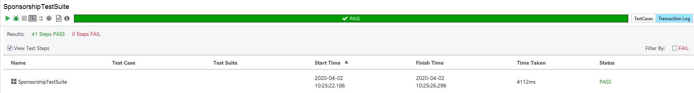

# Simple sponsorship api test suite

### API description

> Complete endpoint and obj reference can be found in ./resources/sponsorship-api.yaml

Simple [getsandbox](https://getsandbox.com/) api provides 2 main features: 
  - Add player record
  - Allow players to "sponsor" others 
  
 #### Restrictions
  - Players must have nickname
  - Players can not sponsor themselves
  - Players must have sufficient balance for sponsorship
  - Players must have borrowing/lending permissions
  
### Data source

Players: 
| nickname | balance | canLend | canBorrow | 
| --- | --- | --- | --- |
| poorGuy | 0 | false | false | 
| richGuy | 1000 | true | true | 
| bannedGuy | 1000 | false | false | 
| addictedGuy | 0 | true | true | 

Sponsorships: 
| creditor | recepient | amount | result | 
| --- | --- | --- | --- |
| richGuy | addictedGuy | 100 | OK
| bannedGuy | richGuy | 100 | Lending not allowed
| richGuy | bannedGuy | 100 | Borrowing not allowed
| poorGuy | addictedGuy | 5000 | Insufficient funds
| richGuy | richGuy | 100 | Self sponsoring not allowed

### Test suite 

Consists of 3 Test cases: 
1. Add user records (And store API generated IDs in ReadyAPI data set )
2. Generate expected results from data set (And verify change in creditor balance if Sponsorship was created)
3. Wipe api (purely optional since IDs are dynamic and records do transfer between first two steps)

#### 1. Add user 
Simple TC with little assertion, main goal is to set up different players for next Case. 
*Can be expanded by assertions, validations and error codes needed on API side*

#### 2. Generate sponsorships
Using returned and stored by previous Case data generates Sponsorships from data set.
*Additionally, improvised creditor balance check using Groovy script has been added to this step.*

#### 3. Delete players and sponsorships
Nothing but a simple DELETE request. Removes all players and their sponsorships.

